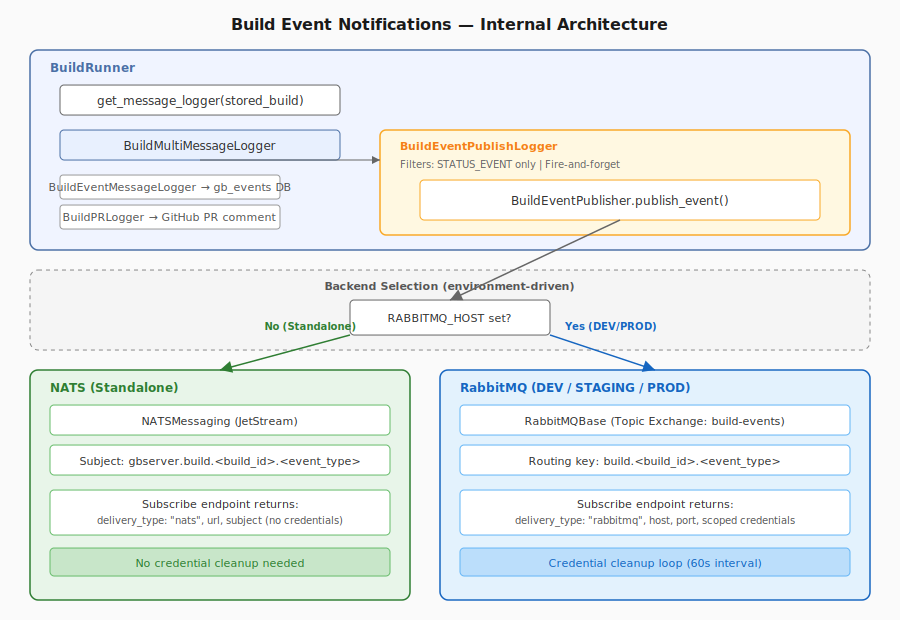

# Architecture

> **Audience:** anyone who wants the big picture of how gbserver is put together — and contributors
> changing its internals.

Granite.Build orchestrates LLM build pipelines. This page is the high-level map of the system; each
subsystem links to its own section, and the [detailed component/flow diagram](arch-diagram.md) and the
[`Environment` class internals](environment-classes.md) go deeper.

## The pieces

The system has a few distinct planes:

- **Definition** — a [`build.yaml`](../builds/README.md) declares targets, steps, and artifact bindings.
- **Control** — the [REST API](../rest-api/README.md) accepts builds; the **BuildWatcher** polls for
  pending builds and dispatches a **BuildRunner** per build; the runner walks the target graph. The
  [`gb` and `gbserver` CLIs](../cli/README.md) drive and run the server.
- **Execution** — each target runs on an [environment](../environments/README.md) (bash, Docker,
  Kubernetes, LSF, RunPod, SkyPilot).
- **Persistence** — build/target/step/artifact metadata is stored in a SQL database.
- **Messaging** — build events are published for real-time subscribers.

Everything a build needs but doesn't declare inline (environments, steps, asset stores, secrets,
variables) comes from its [space](../spaces/README.md).

## The build lifecycle

1. A build is submitted (`gb build start` → `POST /api/v1/builds`), or picked up from a watched PR/repo.
2. The **BuildWatcher** sees the pending build and dispatches a **BuildRunner** (as a k8s job, process,
   or thread — `GBSERVER_DEFAULT_BUILDRUNNER_TYPE`).
3. The runner resolves the build's [space](../spaces/README.md), then walks the [target](../builds/README.md)
   graph in dependency order.
4. For each target it instantiates the target's [environment](../environments/README.md) and runs the
   target's steps; inputs are pulled from and outputs pushed to [asset stores](../environments/README.md#asset-stores).
5. Steps emit [events](../builds/event-notifications.md); status is persisted to the metadata store and
   published to subscribers.

## Subsystems

### Builds

A **build** is one execution of a `build.yaml`: a graph of **targets** (each with an environment,
inputs, outputs, and steps) chained by **bindings**. See [Builds](../builds/README.md).

### Spaces

A **space** is the runtime context that supplies environments, steps, asset stores, secrets, and
template variables, and is registered by name in gbserver. See [Spaces](../spaces/README.md).

### Environments

An **environment** is the compute backend a target runs on, implemented as a subclass of the
`Environment` base class with a launcher/monitor/lifecycle dispatch pattern. See
[Environments](../environments/README.md) and [Environment classes](environment-classes.md).

### Asset stores

**Asset stores** describe where a build's artifacts live and how to reach them, selected by URI scheme —
File, Git, COS/S3, HuggingFace, Lakehouse, and env-local (already-on-a-shared-filesystem). The store
resolves the location and credentials; the environment performs the transfer. See
[Asset stores](../asset-stores/README.md).

### Artifacts

**Artifacts** are the models, datasets, and filesets a build consumes and produces, referenced by URI
and registered in the metadata store (`gb_artifacts`). A target's output becomes another target's input
via a binding. See [Builds](../builds/README.md#artifacts-inputs-and-outputs).

### Secret managers

Credentials are resolved by the space's **secret manager** — `local`, `env`, `hybrid`, or `ibmcloud` —
and referenced by name in assets (never inlined). See [Secrets](../secrets/README.md).

### Metadata storage (SQL)

Build metadata is persisted through a pluggable storage layer selected by `GBSERVER_METADATA_STORAGE`:
`sql` (PostgreSQL via SQLAlchemy) for hosted deployments, or `sqlite` for standalone/local. A
`SingletonAdminStorage` wires one store per entity ([`src/gbserver/storage/`](../../src/gbserver/storage/)).
The main tables:

| Table | Holds |
|-------|-------|
| `gb_builds` | Builds |
| `gb_targets` | Target runs |
| `gb_steps` | Step runs |
| `gb_artifacts` | Registered artifacts |
| `gb_spaces` | Registered spaces |
| `gb_events` | Build events |
| `gb_space_users` | Space membership |
| `gb_ndfail` | Node-failure records |

### Event notification

Build status events are published in real time. In **standalone** mode gbserver uses an embedded
**NATS/JetStream** server (no setup); in **cloud** deployments it uses **RabbitMQ** (when `RABBITMQ_HOST`
is set and `GBSERVER_EVENT_PUBLISHING_ENABLED=true`). Clients subscribe via
`POST /api/v1/builds/{build_id}/events/subscribe`, which returns backend-specific connection details.
See [Event notifications](../builds/event-notifications.md).

## Deeper dives

- [Architecture diagram](arch-diagram.md) — the detailed component and data-flow diagram.
- [Environment classes](environment-classes.md) — the `Environment` base class and its implementations.

## See also

- [Documentation index](../README.md)
- [REST API](../rest-api/README.md) · [Builds](../builds/README.md) · [Environments](../environments/README.md) · [Spaces](../spaces/README.md) · [Secrets](../secrets/README.md)
